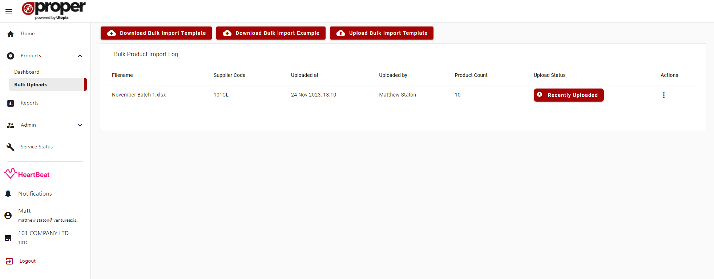
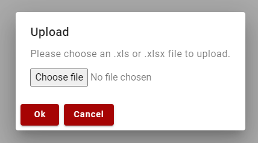
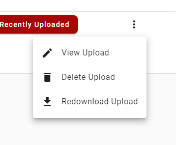

# Dashboard
This dashboard allows you browse the bulk templates that have been uploaded for each Supplier.

## Actions
- Download Bulk Import Template - this action downloads the product bulk import template spreadsheet to your computer
- Download Bulk Import Template Example - this action downloads the product bulk import template spreadeheet with example products and track listing to your computer
- Upload Bulk Import Template - this action opens a file selector popup which allows you to select a single spreadsheet file and upload it to ProperWeb

## Uploading a file

You can upload a file by clicking the "Upload Bulk Import Template" button.

In the file upload popup you can select a single spreadsheet file(.xls/.xlsx) from your computer and upload it to ProperWeb. 

Once the file has been uploaded to ProperWeb, a bulk upload will be created and any products created will be associated to this bulk upload 

## Context Menu Actions

By right clicking a table row or click the action menu button at the end of the row you can access the following context menu actions:
- View Upload - this action navigates to the bulk upload details page where you can see the products in the bulk upload
- Delete Upload - this action will delete the bulk upload and any products associated with it
- Redownload Upload- this action takes the bulk upload and will create and download a spreadsheet file containing all the products related to it