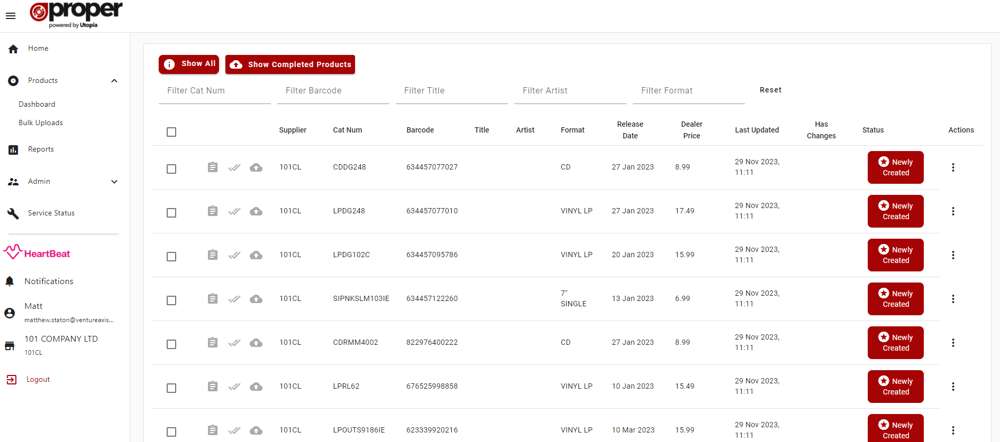
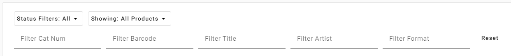

# Details
Opening a bulk upload will take you to this bulk upload details page where you can see the products listed within it. Here you can search, edit and upload products.

From the details page you can:
- Search for exisiting products within the selected bulk upload.
- View/Edit a Product in the editor.
- Multi-select Products from the table to:
  - Upload selected that have been approved to basil
  - Delete selected
  - Approve eligible selected

## Product Search

On the Product dashboard you can search by fields:
- Catalogue Number (Cat Num)
- Barcode
- Title 
- Artist
- Format

You can also filter by [Product Statuses](#product-statuses) and whether or not a Product has completed or not via the "Show Completed Products" / "Hide Completed Products" button. The reset button will clear the values in the text search fields.

The current value of your text search fields will be saved to your browser for when you log back in.

## Product Statuses {#product-statuses}
There are 8 Product statuses within ProperWeb which are:

### Newly Created
A Product will have this status when it has been created, doesn't pass validation and has been marked as draft.

### Ready for Review
A Product will have this status when it is not marked as draft, hasn't yet been approved by an Administrator and has not yet been uploaded to Basil.

### Reviewed with Comments
A Product will have this status when comments have been added by an Administrator user.

### Approved for Upload
A Product will have this status when it has been approved for upload to basil.

### Changes to Review
A Product will have this status when it has been uploaded to Basil and changes have been made that need to be reviewed before uploading those changes to Basil.

### Uploaded with Warnings
A Product will have this status when it has been uploaded to Basil but the ProperAPI service has reported some non-urgent warnings with the Product during the upload.

### Failed to Upload
A Product will have this status when it was attempted to be uploaded to Basil but didn't pass the ProperAPI service validation.

### Completed
A Product will have this status when it has been successfully uploaded to Basil with no issues.

## Context Menu Actions

- Edit Product - opens the product in the editor
- Copy Product - creates a copy of the product and opens it in the editor
- Send to Basil - uploads the product to Basil, only available 
- Delete Product - deletes the product from ProperWeb
- Keep Product - detaches the product from the Bulk Upload so it isn't removed from the system if the bulk upload is deleted