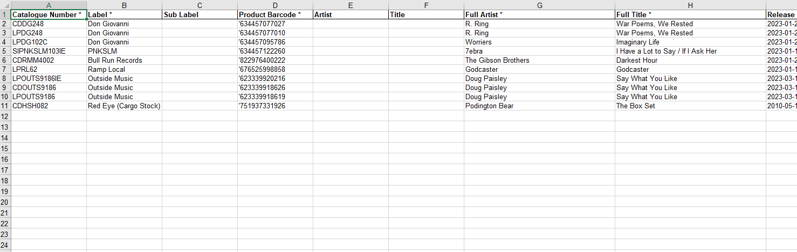
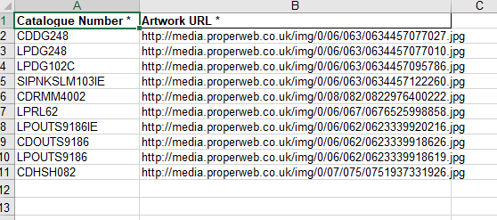
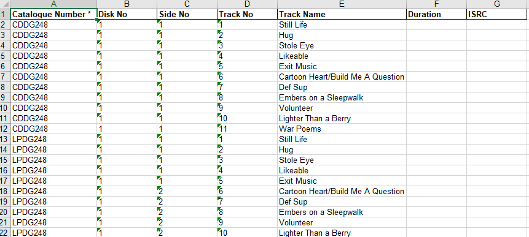

# Template

Opening the Bulk Import template will bring you to the Product sheet, this will either be empty if you downloaded the standard template or have a few products inside if you downloaded the example template.

## Main Sheets
The template has 5 product sheets which the importer will use to create the bulk upload and products within ProperWeb.

The main product sheets are:
- Products - the majority of the products information
- Product Artwork - any artwork urls that need to be associated with the products
- Product Video - any video urls that need to be associated with the products
- Product Tracks - track listings to be associated with the products
- Product Track Contributors - any Contributors to be associated with the product track listings

### Products
This is the main sheet for the product data.

#### Text Columns
These columns are simple text columns:
- Product Catalogue Number
- Label
- Sub Label
- Product Barcode
- Artist
- Title
- Full Artist
- Full Title
- SoundCloud Link Url
- Exclusive For
- Variant
- Marketing Info
- Narrative

#### Number Columns
These columns should be a number (integer or decimal depending on the column):
- Units (integer)
- Weight (decimal)
- Length (decimal)
- Width (decimal)
- Height (decimal)
- Dealer Price (decimal)
- Buy Price (decimal)
- HMV Price (decimal)

#### Boolean Flag Columns
These columns should be a text version of 'true' or 'false':
- Export Only
- Is Indie Exclusive
- Is Christmas Title

#### Date Columns
These columns should be a date string in the format (YYYY-MM-DD):
- Release Date
- Embargo Date

#### Proper Codes Columns
These fields need to refrence the codes in their respective sheets (e.g. Product Format needs to reference a code or description from the Format Code column in the Product Format sheet), they can also be left blank.

- Primary Genre
- Secondary Genre
- Product Format 
- Product Form
- Product Package
- DVD Age Rating
- DVD Regions
- Country of Origin

### Product Artwork 
Product Catalogue Number column must reference an existing product catalogue Number in the main product sheet.

### Product Video
Product Catalogue Number column must reference an existing product catalogue Number in the main product sheet.

### Product Tracks
Product Catalogue Number column must reference an existing product catalogue Number in the main product sheet.

### Product Track Contributors
- Product Catalogue Number column must reference an existing product catalogue Number in the main product sheet.
- Index columns (Disk No, Side No, Track No) must reference an existing track the Product Track sheet.

## Proper Codes Sheets
The template also contents an at the time of download copy of all the Proper Codes within ProperWeb. These codes can be refrenced in the main product sheets so that the importer can properly link the codes to each product.

The Proper Codes sheets are:
- Contributor Roles
- Countries
- Product Genres
- Product Formats
- Product Forms
- Product Packages
- DVD Age Ratings
- DVD Regions