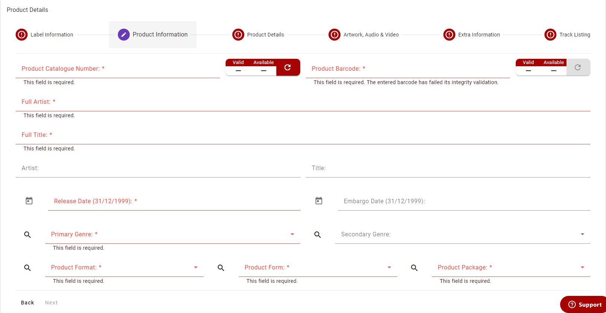

import Tabs from '@theme/Tabs';
import TabItem from '@theme/TabItem';

# 2 - Product Information
In this part of the form you'll enter the main information for the Product.

:::info

Some **fields** have different validation depending on the Supplier class selected when creating a Product, see below.

:::

## Required Fields

<Tabs groupId="supplier-class">
  <TabItem value="standard" label="Standard">
    <ul>
        <li><strong>Sku</strong> - todo</li>
        <li><strong>Barcode</strong> - todo</li>
        <li><strong>Full Artist</strong> - todo</li>
        <li><strong>Full Title</strong> - todo</li>
        <li><strong>Release Date</strong> - select from the date picker an Release date</li>
        <li><strong>Primary Genre</strong> - select from the dropdown or search from a list of primary genre codes</li>
        <li><strong>Format</strong> - select from the dropdown or search from a list of format codes, changing to a DVD format will display the DVD Age Rating and DVD Region fields</li>
        <li><strong>Form</strong> - select from the dropdown or search from a list of form codes</li>
        <li><strong>Package</strong> - select from the dropdown or search from a list of package codes</li>
    </ul>
  </TabItem>
  <TabItem value="third-party" label="Third Party">
    <ul>
        <li>Sku - todo</li>
        <li>Barcode - todo</li>
        <li>Full Artist - todo</li>
        <li>Full Title - todo</li>
        <li><strong>Release Date</strong> - select from the date picker an Release date</li>
        <li>Format - select from the dropdown or search from a list of format codes, changing to a DVD format will display the DVD Age Rating and DVD Region fields</li>
        <li>Form - select from the dropdown or search from a list of form codes</li>
        <li>Package - select from the dropdown or search from a list of package codes</li>
    </ul>
  </TabItem>
</Tabs>

## Optional Fields

<Tabs groupId="supplier-class">
  <TabItem value="standard" label="Standard">
    <ul>
        <li><strong>Artist</strong> - the Artist short text
            <ul>
                <li>Must be in capitals</li>
                <li>Max length: 30 characters</li>
                <li>Input is automatically converted into uppercase</li>
                <li>Autofilled when typing in Full Artist field</li>
            </ul>
        </li>
        <li><strong>Embargo Date</strong> - select from the date picker an Embargo date</li>
        <li><strong>Secondary Genre</strong> - select from the dropdown or search from a list of secondary genre codes</li>
        <li><strong>DVD Age Rating (DVD Formats Only)</strong> - select from the dropdown or search from a list of DVD Age Rating codes</li>
        <li><strong>DVD Region (DVD Formats Only)</strong> - select from the dropdown or search from a list of DVD Region codes</li>
    </ul>
  </TabItem>
  <TabItem value="third-party" label="Third Party">
    <ul>
        <li><strong>Artist</strong> - the Artist short text
            <ul>
                <li>Must be in capitals</li>
                <li>Max length: 30 characters</li>
                <li>Input is automatically converted into uppercase</li>
                <li>Autofilled when typing in Full Artist field</li>
            </ul>
        </li>
        <li><strong>Embargo Date</strong> - select from the date picker an Embargo date</li>
        <li><strong>Primary Genre</strong> - select from the dropdown or search from a list of primary genre codes</li>
        <li><strong>Secondary Genre</strong> - select from the dropdown or search from a list of secondary genre codes</li>
        <li><strong>DVD Age Rating (DVD Formats Only)</strong> - select from the dropdown or search from a list of DVD Age Rating codes</li>
        <li><strong>DVD Region (DVD Formats Only)</strong> - select from the dropdown or search from a list of DVD Region codes</li>
    </ul>
  </TabItem>
</Tabs>

## Basil Validation Widgets
The Sku and barcode fields have widgets next to them which allow the checking of inputs before the product is saved to ProperWeb. This allows you to check whether the Sku or Barcode is valid and is available for use within the Basil system before attempting to upload it. The widgets will perform a check each time the input changes provided local validation passes first (e.g correct length and format).

