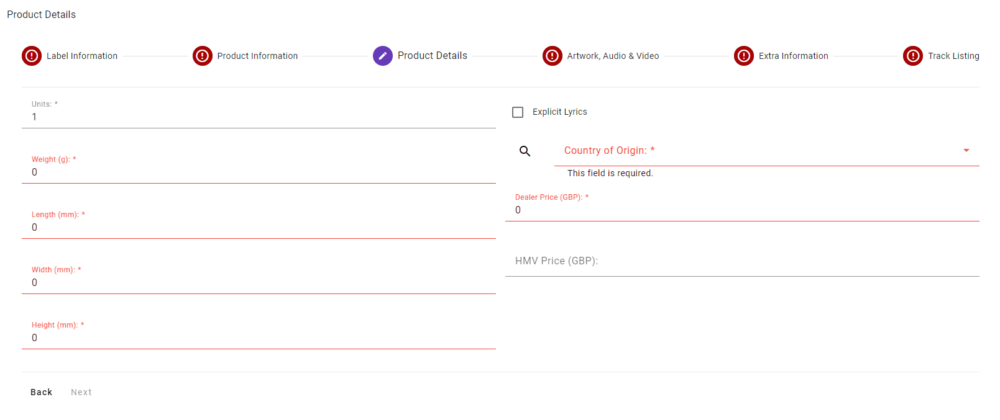

# 3 - Product Details
In this part of the form you'll enter the dimensions, pricing, country of origin and whether or not the Product has Explicit Lyrics.

## Required Fields
<ul>
	<li><strong>Weight (g)</strong> - weight in grams
		<ul>
			<li>Integer (Whole Numbers Only)</li>
			<li>Minimum value of 1</li>
		</ul>
	</li>
	<li><strong>Length (mm)</strong> - length in millimetres
		<ul>
			<li>Integer (Whole Numbers Only)</li>
			<li>Minimum value of 1</li>
		</ul>
	</li>
	<li><strong>Width (mm)</strong> - width in millimetres
		<ul>
			<li>Integer (Whole Numbers Only)</li>
			<li>Minimum value of 1</li>
		</ul>
	</li>
	<li><strong>Height (mm)</strong> - height in millimetres
		<ul>
			<li>Integer (Whole Numbers Only)</li>
			<li>Minimum value of 1</li>
		</ul>
	</li>
	<li><strong>Country of Origin</strong> - select from the dropdown or search from a list of country codes</li>
	<li><strong>Dealer Price</strong> - the Title short text
		<ul>
			<li>Decimal values</li>
			<li>Minimum value of 0.01</li>
			<li>Defaults to 1.00</li>
		</ul>
	</li>
</ul>

## Optional Fields
<ul>
	<li><strong>Units</strong> - number of units within each package
		<ul>
			<li>Integer (Whole Numbers Only)</li>
		</ul>
	</li>
	<li><strong>Explicit lyrics</strong> - checkbox to indicate whether the Product has Explicit Lyrics</li>
	<li><strong>HMV Price</strong> - the NET price to HMV
		<ul>
			<li>Needs to be in the right currency for the creating Supplier</li>
		</ul>
	</li>
</ul>