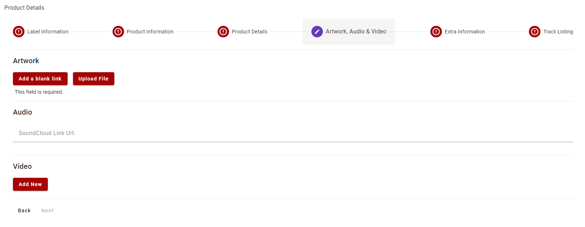

import Tabs from '@theme/Tabs';
import TabItem from '@theme/TabItem';

# 4 - Artwork, Audio & Video
In this part of the form you'll add artwork urls/images, audio urls and video urls

## Required Fields
<Tabs groupId="supplier-class">
	<TabItem value="standard" label="Standard">
		<ul>
			<li><strong>Artwork</strong> - a collection of artwork images for the Product
				<ul>
					<li>At least one Artwork URL/Image must be present</li>
				</ul>
			</li>
		</ul>
	</TabItem>
</Tabs>

## Optional Fields

<Tabs groupId="supplier-class">
  <TabItem value="standard" label="Standard">
    <ul>
        <li><strong>SoundCloud Link Url</strong> - audio link for the product tracks</li>
        <li><strong>Video</strong> - add multiple urls for videos related to the Product e.g. YouTube</li>
    </ul>
  </TabItem>
  <TabItem value="third-party" label="Third Party">
    <ul>
        <li><strong>Artwork</strong> - a collection of artwork images for the Product</li>
        <li><strong>SoundCloud Link Url</strong> - audio link for the product tracks</li>
        <li><strong>Video</strong> - add multiple urls for videos related to the Product e.g. YouTube</li>
    </ul>
  </TabItem>
</Tabs>