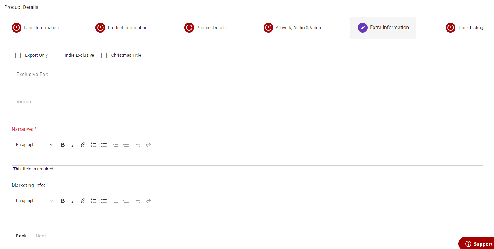

import Tabs from '@theme/Tabs';
import TabItem from '@theme/TabItem';

# 5 - Extra Information
In this part of the form you'll enter any extra fields that don't fit in the other categories.

:::info

Some **fields** have different validation depending on the Supplier class selected when creating a Product, see below.

:::

## Required Fields
<Tabs groupId="supplier-class">
	<TabItem value="standard" label="Standard">
		<ul>
			<li><strong>Narrative</strong>
				<ul>
					<li>Max length is 5120 characters</li>
				</ul>
			</li>
		</ul>
	</TabItem>
</Tabs>

## Optional Fields

<Tabs groupId="supplier-class">
  <TabItem value="standard" label="Standard">
    <ul>
        <li><strong>Export Only</strong> - checkbox to mark whether or not the Product is Export Only</li>
        <li><strong>Indie Exclusive</strong> - checkbox to mark whether or not the Product is Indie Exclusive</li>
        <li><strong>Christmas Title</strong> - checkbox to mark whether or not the Product is a Christmas Title</li>
        <li><strong>Exclusive For</strong>
			<ul>
				<li>Max length is 50 characters</li>
			</ul>
		</li>
        <li><strong>Variant</strong>
			<ul>
				<li>Max length is 50 characters</li>
			</ul>
		</li>
		<li><strong>Marketing Info</strong>
			<ul>
				<li>Max length is 50 characters</li>
			</ul>
		</li>
    </ul>
  </TabItem>
  <TabItem value="third-party" label="Third Party">
    	<ul>
			<li><strong>Narrative</strong>
				<ul>
					<li>Max length is 5120 characters</li>
				</ul>
			</li>
			<li><strong>Export Only</strong> - checkbox to mark whether or not the Product is Export Only</li>
			<li><strong>Indie Exclusive</strong> - checkbox to mark whether or not the Product is Indie Exclusive</li>
			<li><strong>Christmas Title</strong> - checkbox to mark whether or not the Product is a Christmas Title</li>
			<li><strong>Exclusive For</strong>
				<ul>
					<li>Max length is 50 characters</li>
				</ul>
			</li>
			<li><strong>Variant</strong>
				<ul>
					<li>Max length is 50 characters</li>
				</ul>
			</li>
			<li><strong>Marketing Info</strong>
				<ul>
					<li>Max length is 50 characters</li>
				</ul>
			</li>
		</ul>
  </TabItem>
</Tabs>