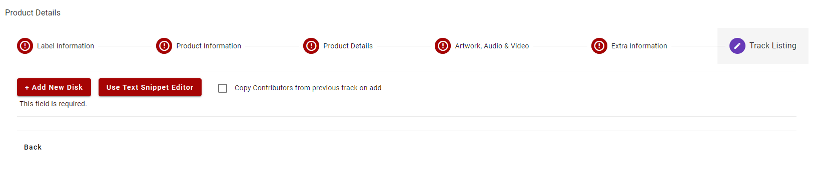
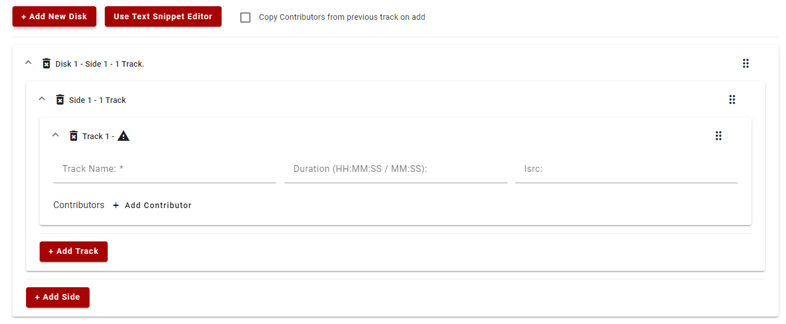
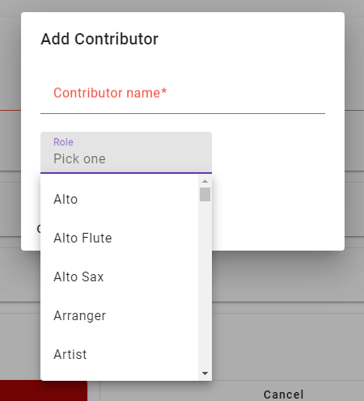
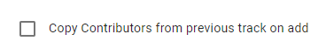
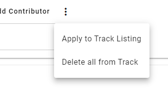
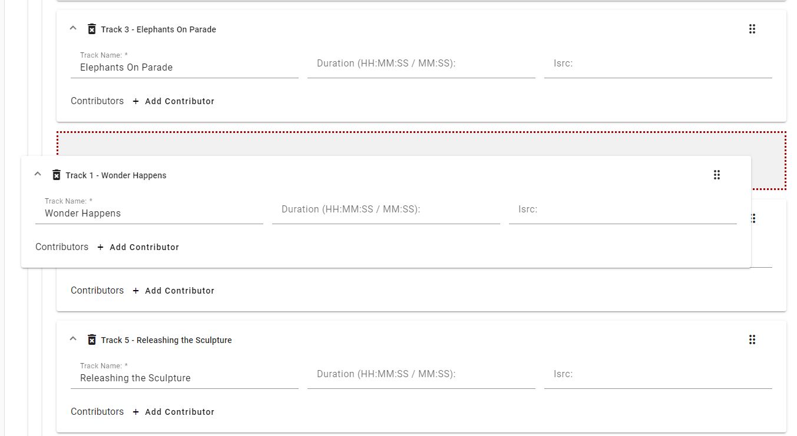
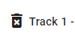
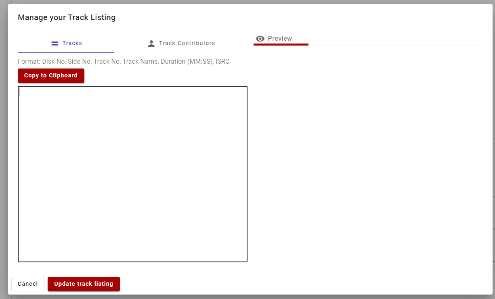
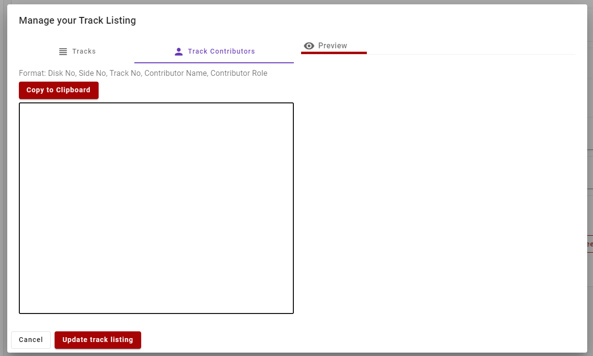
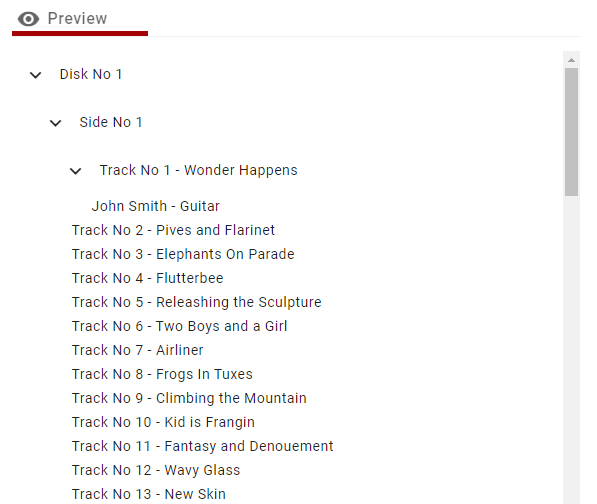

import Tabs from '@theme/Tabs';
import TabItem from '@theme/TabItem';

# 6 - Track  Listing
In this part of the form you'll enter the track listing for the Product.

:::info

Track listing is required for Standard class Suppliers but is optional for Third Party class Suppliers.

:::



## Track Listing Editor



### Adding a Disk and Side
Clicking the "Add New Disk" button will add a new Disk to the Track Listing as well as a new Side and new Track.

A Track Listing can have a maximum of two Disks and each Disk can have a maximum of two Sides.

### Tracks

#### Required Fields
- Track Name

#### Optional Fields
- Duration - duration of the track, must be HH:MM:SS or MM:SS format
- Isrc
- Contributors

#### Contributors
Whilst having Contributors on the Track Listing is optional, any Contributors added to a Track must have at least a Contributor Name.

The Contributor role is optional and is selected from a dropdown of codes from the ProperApi service.



At the top of the editor there is a "Copy Contributors from previous track on add" checkbox which when checked, will copy all of contributors from the previous track when adding a new one. If the new track is the first track on a side, the contributors from the last track on the previous side will be applied. If there are no tracks on the previous side then the previous disk will be checked.



##### Contributor Actions

Next to the "Add Contributor" button you can open an menu which will have the following actions:
- Apply to Track Listing - this applies the contributors from this track to every track currently in the entire listing
- Delete all from Track - this deletes all contributors from the current track



### Drag and Drop
Each level of the Track Listing (Disk/Side/Track) can be re-arranged by using the drag handle to the right of the element.




### Deleting a level
Disks, Sides and Tracks can be deleted from the Track Listing by using the button next to the level name:

E.g. for Tracks:




## Text Snippet Editor
The Text Snippet Editor is another way of adding a track listing to your Product. This editor allows you to copy and paste a track listing (providing it's in the right format) into a text area and have it parsed into the Product form.

### Tracks Text Area

When pasting into the Tracks Text Area the format of the needs to be:

>Disk No, Side No, Track No, Track Name, Duration, ISRC

For Example one track would be:
>`1,1,1,Of Wind Water and Sand,00:00,GBQS21200001`

Tabs can also be used as a separator instead of commas

For Example one track would be:
>```1	1	1	Of Wind Water and Sand	00:00	GBQS21200001```

If Track names have special characters or the separator characters in them then you can surround the name in double quotes like this:
> ```1,1,1,"The Lion, Witch and the Wardrobe",00:00,GBQS21200001```



### Track Contributors Text Area

When pasting into the Contributors Text Area the format of the needs to be:

>Disk No, Side No, Track No, Contributor Name, Contributor Role

Each contributor will have it's own line.

For Example a contributor for a track would be:
>```1	1	1	John Smith	Guitar```

:::note

The Contributor Role needs to be in the list of codes from the Proper API Service, otherwise you'll see the message:

 ```No/Invalid Role```

:::



### Preview pane

The preview pane indicates what will be saved into the Track Listing form when the "Update Track Listing" button is pressed.

