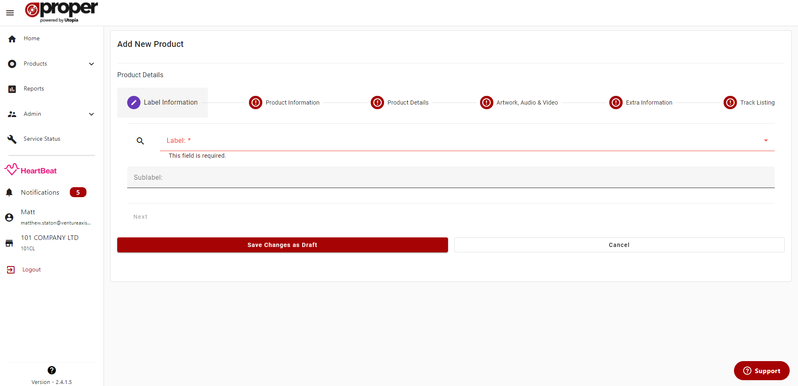
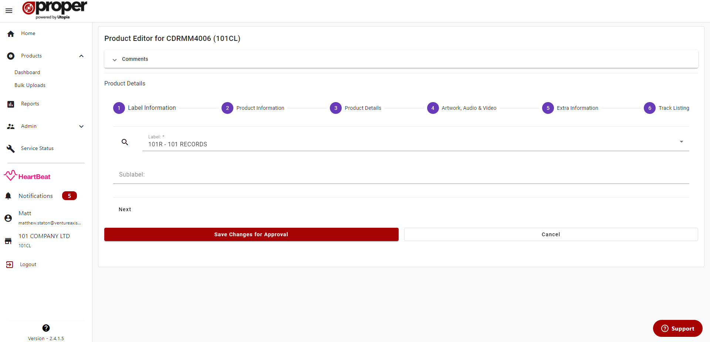
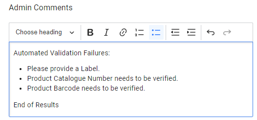

# Product Editor Overview
## Create and Edit modes
The Product Editor is opened in either Create or Edit mode depending on whether you are creating a new Product or editing an existing one.

### Create Mode
In Create mode, the user will be greeted with this screen:

### Edit Mode
In Edit mode, the user will be greeted with this screen:

When in edit mode, depending on the Product state, the header will appear with:

- Just the Catalogue Number title

- The Catalogue Number title and the "DRAFT" Bubble (When a Product is Draft but not uploaded)

- The Catalogue Number title with the "UPLOADED - CANNOT EDIT" (When a Product has been uploaded to basil)

If an Product has been uploaded the Edit Form will be disabled and look like this:

## Form Steps
The Product Editor in ProperWeb is broken down into 6 steps each with their own validation, the steps are:
- Label Information
- Product Information
- Product Details
- Artwork, Audio & Video
- Extra Information
- Track Listing

## Comments
Administrators and non administrator users can leave comments on each indiviudal product as a way of communicating issues with the product form before it can be approved.
This is done by adding your comments to the relevant text area and clicking the "Save Comments" button.

### Auto Validation Results
Each time you save a Product, ProperWeb will perform a validation pass of the Product on the server, if there any warning messages that come from this process, they will be added to the Admin comments for review.

