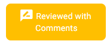
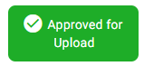
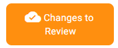
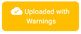
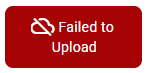

# Product Dashboard
The Product dashboard is the main way to interact with Products within ProperWeb.

From the dashboard you can:
- Create a new Product in the editor
- Search for exisiting products within ProperWeb.
- View/Edit a Product in the editor.
- Multi-select Products from the table to:
  - Upload selected that have been approved to basil
  - Delete selected
  - Approve eligible selected

## Product Actions

### Create Product
This will open the Product Editor with a blank form for a new Product. You can only create a new Product if you have a single Supplier selected from the Supplier Filter Switcher in the side menu.

### Approve All Selected
This action will Approve all non-draft Products (products which have passed validation) in the current selection.

### Upload All Selected
This action will upload all eligible Products (Products which have passed validation and are approved) in the current selection to Basil.

### Delete All Selected
This action will delete all eligible Products (Products that haven't been uploaded to Basil) in the current selection from ProperWeb.

### Clear Selection
This action will "uncheck" all the currently selected Products from the table

### Context Menu Actions

Right clicking on a table row or using the actions button at the end of the row will open the Product context menu from which you can choose from the following actions:
#### Edit Product
This action will open the Product Editor for the selected Product.

#### Copy Product
This action will create a copy of the selected Product and open the new copy in the Product Editor.

#### Send to Basil
This action will upload the selected Product to Basil (only available when the Product has passed validation).

#### Delete Product
This action will delete the selected Product from ProperWeb (only available when Product hasn't been uploaded to Basil).

## Product Search

On the Product dashboard you can search by fields:
- Sku
- Barcode
- Title 
- Artist
- Format

You can also filter by [Product Statuses](#product-statuses) and whether or not a Product has completed or not via the "Show Completed Products" / "Hide Completed Products" button. The reset button will clear the values in the text search fields.

The current value of your search preferences will be saved to your browser for when you log back in.

## Product Statuses {#product-statuses}
There are 8 Product statuses within ProperWeb which are:

### Newly Created
A Product will have this status when it has been created, doesn't pass validation and has been marked as draft.

### Ready for Review
A Product will have this status when it is not marked as draft, hasn't yet been approved by an Administrator and has not yet been uploaded to Basil.

### Reviewed with Comments
A Product will have this status when comments have been added by an Administrator user.

### Approved for Upload
A Product will have this status when it has been approved for upload to basil.

### Changes to Review
A Product will have this status when it has been uploaded to Basil and changes have been made that need to be reviewed before uploading those changes to Basil.

### Uploaded with Warnings
A Product will have this status when it has been uploaded to Basil but the ProperAPI service has reported some non-urgent warnings with the Product during the upload.

### Failed to Upload
A Product will have this status when it was attempted to be uploaded to Basil but didn't pass the ProperAPI service validation.

### Completed
A Product will have this status when it has been successfully uploaded to Basil with no issues.

