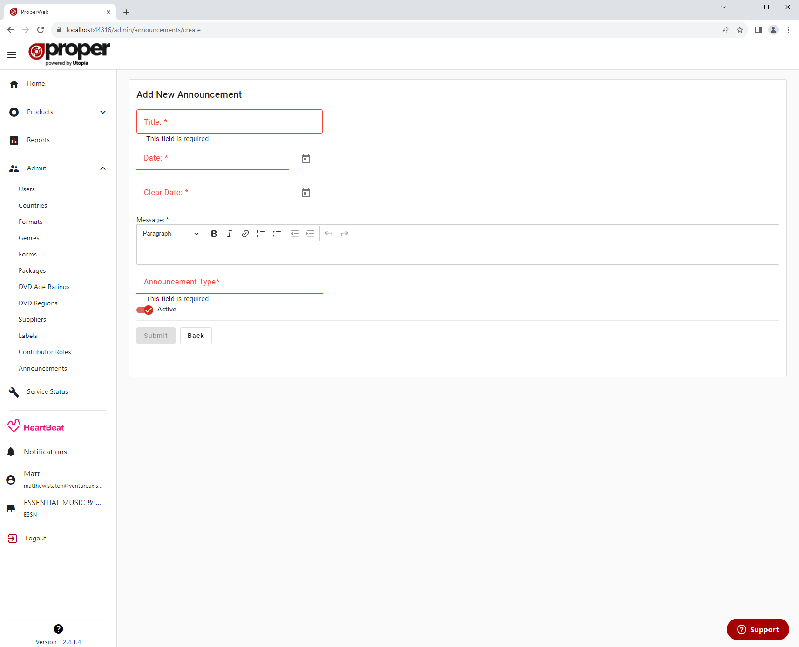

# Creating an Announcement
Administrator users can create announcement posts which are shown on the home page and sent out to users (providing they have the correct notification preferences).

Each Announcement needs to have:
- A title - the header of the Announcement
- Date - the date from which the Announcement is visible on the home page
- Clear Date - the date from which the Announcement is active until
- Message - the content body of the Announcement
- Announcement Type - An type field to give extra context to the Announcement (E.g. News/Updates/Issues)

Annoucements are also set to Active by default but can be disabled here.
The Active toggle is an extra way of controlling visibility of an Annoucement, an Announcement will only appear on the home page is Active is enabled and the current date is within the Date and Clear Date of the Announcement post.

