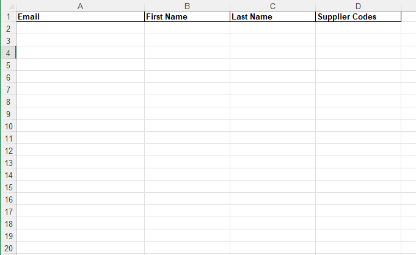
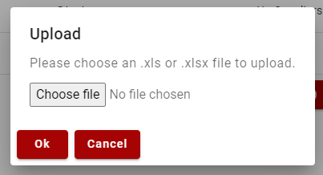

# Bulk Upload Users

Users can be bulk imported into ProperWeb by downloading the bulk import template spreadsheet from the dashboard, filling out the template file, then reupload it using the file upload popup.

Users imported via bulk upload template will be created as General(Supplier) users.

Any email addresses currently in use in the system will be skipped.

## Columns
- Email
- First Name (Forename)
- Surname (Surname)
- Supplier Codes - comma separated codes (e.g. PPUB, PALM, PIPE) assigned to the current user row

## Upload Popup

