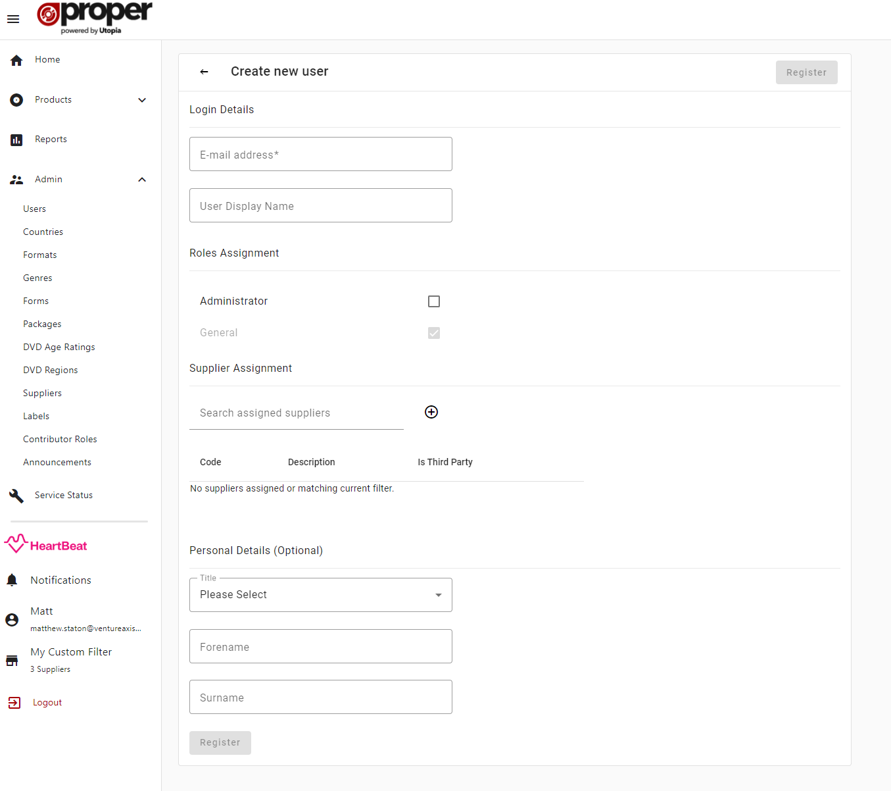

# Creating a User

To create a user, fill out the form with the required fields then click the "Register" button. Users will be sent an activation email where they can follow a link to create themselves a password and login to the system for the first time.

## Required Fields
- Email Address - used for login and sending email notifications
- Role - defaults to "General"(supplier)

## Optional Fields
- User Display Name - name displayed on the side menu
- Suppliers - list of supplier codes assigned to a user
- Title
- Forename
- Surname

## Roles
The roles available to assign to users in ProperWeb:
- General(Supplier) - this is the default role
- Administrator - this role allows access to all parts of the ProperWeb System.

## Supplier Assignment
Users can be assigned one or more supplier codes in ProperWeb which allows them to filter page content based their chosen supplier.
This can be done by clicking the plus icon next to the search box which opens a search popup where supplier codes can be multi selected.
