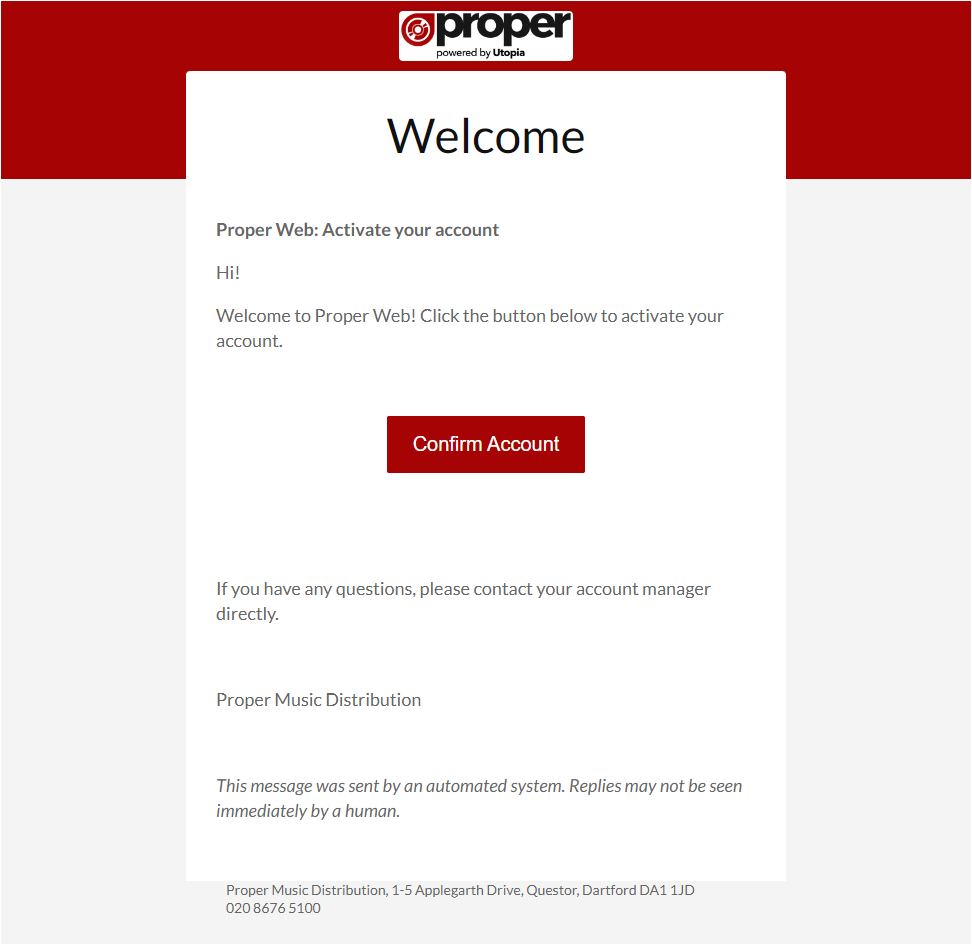
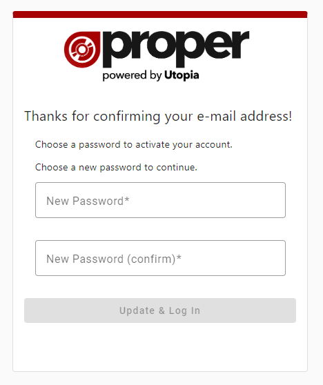

# Activating your Account

Once an Administrator has created your account you will be sent an email with a link asking you to confirm your email address and create
a password for your account.

Following the link a browser tab will open with the page below where you can set your user password.

After filling out your password you can click the "Update & Log In" button and you will be logged in and redirected to the home page.

