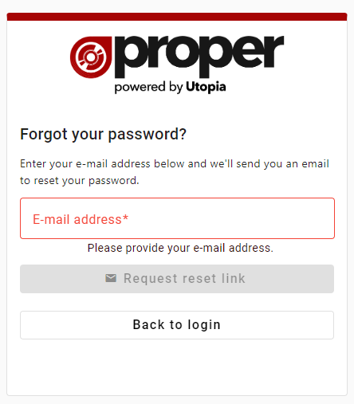
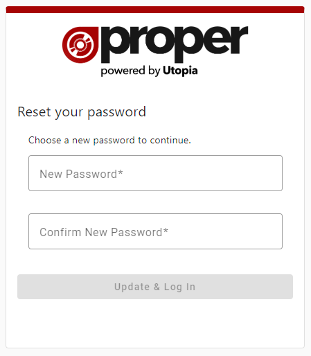

# Forgotten Password
## 1 - Requesting a reset email
If you have forgotten your password for ProperWeb you can request a reset link email by following the "Forgotten your password?" link on the login page.

To recieve a reset link email simply enter your email into the field and hit the "Request rest link" button.

If a link has successfully been sent you'll see this message on the page.

## 2 - Receiving the reset email
When the link has been sent successfully you'll receive an email which will look like this:

Click the "Reset Password" button and you'll arrive at the Reset Password Page.

## 3 - Choosing a new password

Once you arrive at the Reset Password Page you'll need to enter a new password, confirm it and then click the "Update & Log In" button.
If your password reset was successful you'll be logged in and redirected to the home page.

