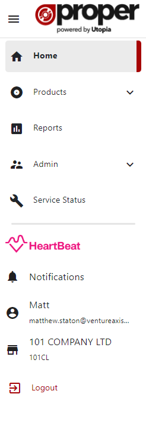

# Menu

The side menu is the main method of navigation in ProperWeb. You can use it to navigate around the site, access your notifications, user account and change your currently selected Supplier Filter which controls how certain pages are displayed.

## Menu Items
See below for the current listing of menu items/features:

### Main Menu
- Home - Welcome header and Announcements
- Products (sub menu)
	- Dashboard - Product Dashboard for viewing and managing products within ProperWeb
	- Bulk Uploads - Dashboard for viewing/uploading bulk products
	- Product Importer - Browser for importing products into ProperWeb from Basil
- Reports - Access to the Supplier Stock report email trigger
- Admin (sub menu)
	- Users - dashboard for viewing and managing users in the System
	- Countries - dashboard for viewing and fetching Proper Codes for Countries
	- Formats - dashboard for viewing and fetching Proper Codes for Product Formats
	- Genres - dashboard for viewing and fetching Proper Codes for Product Genres
	- Forms - dashboard for viewing and fetching Proper Codes for Product Forms
	- Packages - dashboard for viewing and fetching Proper Codes for Product Packages
	- DVD Age Ratings - dashboard for viewing and fetching Proper Codes for DVD Age Ratings
	- DVD Regions - dashboard for viewing and fetching Proper Codes for DVD Regions
	- Suppliers - dashboard for viewing and fetching Proper Codes for Suppliers
	- Labels - dashboard for viewing and fetching Proper Codes for Labels
	- Contributor Roles - dashboard for viewing and fetching Proper Codes for Contributor Roles
	- Announcements - dashboard for viewing and managing Announcements in the System
- Service Status - Allows manual checking of the service status of the Proper API Service

### Other items and features
- Heartbeat - shows a promo popup for the Utopia Heartbeat System allowing users to follow the link and sign up.
- Notifications - access to the user notifications feed, marking notifications as read, deleting the and preference settings
- User Account - access to the user account page
- Supplier Filter Switcher - access to the Supplier Filter Switcher popup
- Logout - button for logging out of your user account.