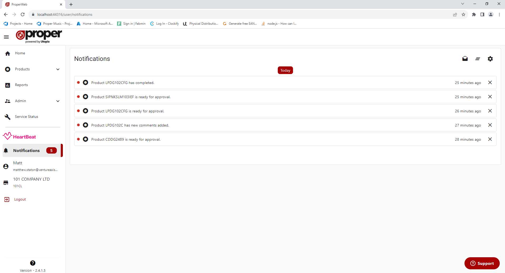

# Overview
ProperWeb supports sending web app and email notifications to it's users based off different events and criteria.

Users only receive notifications for events they are opted in for (all by default) and for events they did not start (e.g. if you approved a product you will not recieve a notification saying that product was approved).

## Feed

The User Notification feed can be accessed via the side menu, here you can:
- View all your current notifications
- Mark all notifications as read
- Delete all notifications
- Access your notification settings

Clicking on a notification will take to relevant part of the site that the notification is based on, see each notification type for more details

