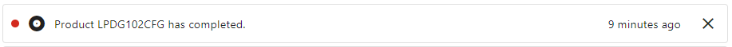

# Product
Below you will find the Product related notifications available in ProperWeb. Only users assigned to the same Supplier as the associated Product and the relevant notifcation preferences will be sent notifications.

## Product Ready for Approval (Admin Only)
When a Product is saved/updated and passes validation criteria it will be marked as being read for approval and this notification will be sent.

## Product Approved
When a Product is approved by an Administrator user this notification will be sent.

## Product Comments Added
When a Product has new comments saved against it this notification will be sent.

## Product Completed
When a Product is completed (gone through approval and successfullly uploaded to Basil) this notification will be sent.

