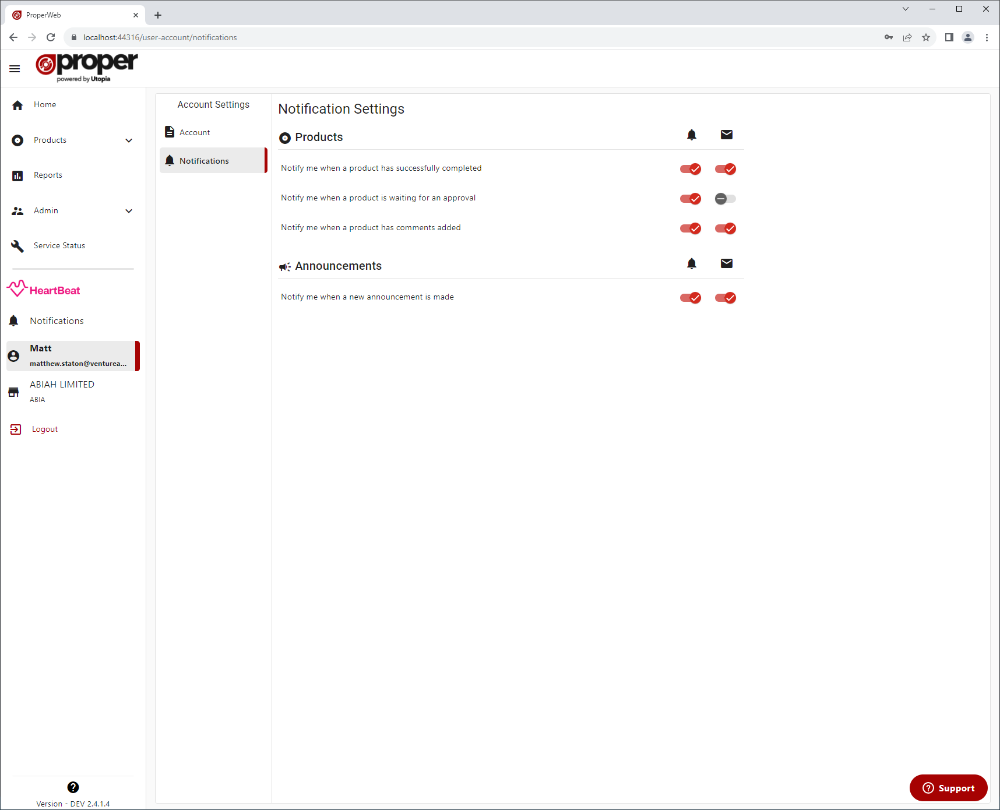

# Settings
User notification settings can be accessed via the User Account page or via the settings button on the notification feed page.

Here you can toggle whether or not you would like to recieve app/email notifications for different types of notifications.

## Categories
Notification settings are grouped by category, there are currently 2 different categories of notifications:
- Product - notifications concerning the product creation process
- Announcement - notifications concerning system announcements