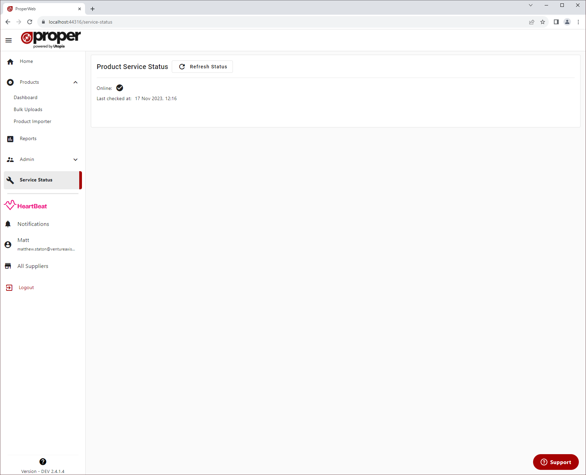

# Service Status
This page allows you to manually check the service status of the Proper API Service.

This service must be online to be able to:
- Upload products to Basil
- Search Basil for existing products
- Fetch latest Proper Codes into Proper Web
- Check validatity of Product Catalogue Number and Barcode during using the widgets in the product editor

