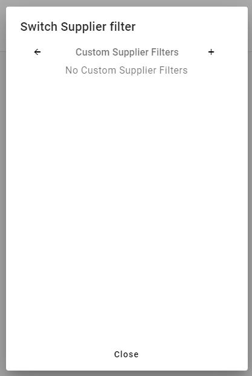
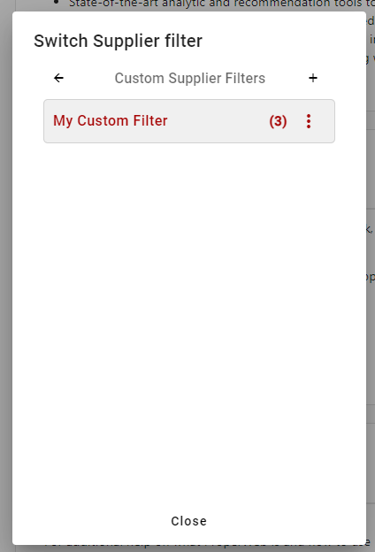
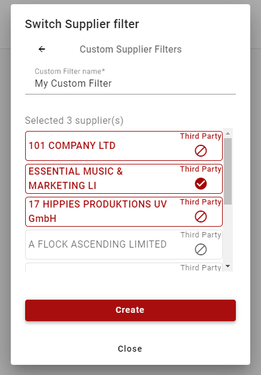
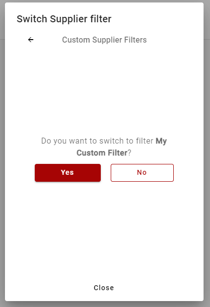
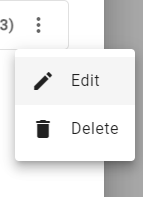

# Custom Filter
Creating custom filters alllow you to filter by select suppliers that have been assigned to your user.

## Selecting a Custom Filter

## Creating a Custom Filter
When creating a custom filter you need to enter a name for your new filter and select at least 2 suppliers from your assigned list.

Click create and you'll be asked if you want to switch to the new filter straight away.

## Context Menu
The custom filter popup also has a context menu which can be accessed from the action button next to the supplier count. In the menu you can:

- Edit - edit the custom filter
- Delete - delete the custom filter

