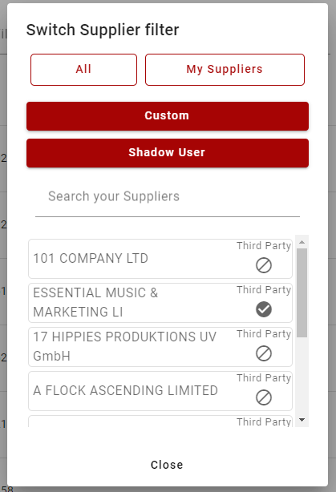
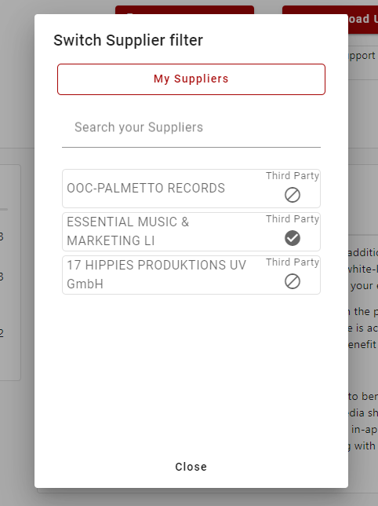

# Overview
The menu in ProperWeb contains a button which allows you to switch what Supplier Filter you are currently using. This filter is used on several different pages within ProperWeb to limit data on pages to certain Supplier Codes.

Pages/features that currently use the Supplier Filter:
- Product Dashboard
- Bulk Upload Dashboard
- Bulk Upload Details
- Uploading a bulk product template
- Creating a new product
- Proper Codes: Labels
- Request Supplier Stock Email Popup

## Admin User

## General User (Supplier)

