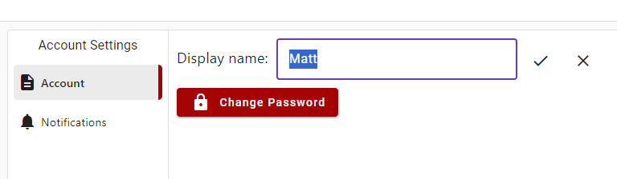

# Changing your Display Name
To change your display name you can click in the text box next to "Display Name" and your current display name will be highlighted. Change it to your desired new display name then click the tick icon button.

