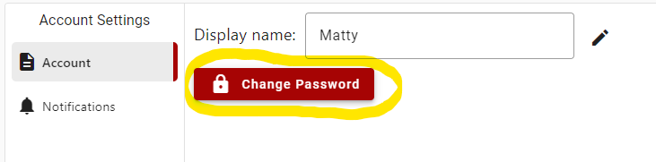
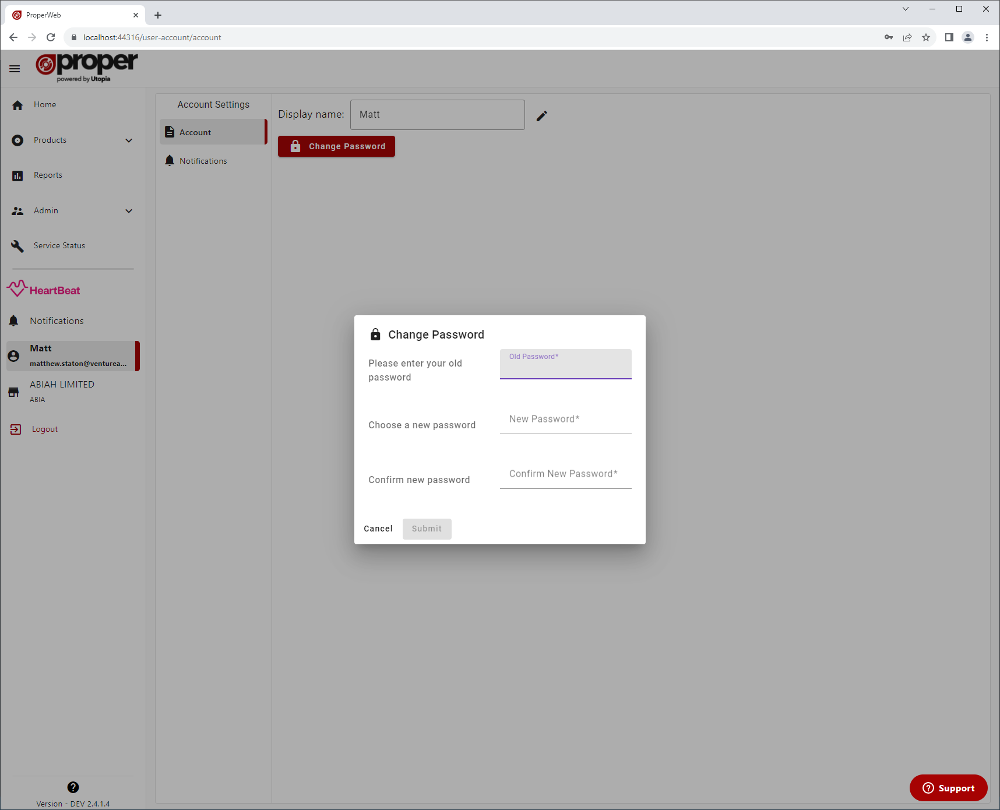
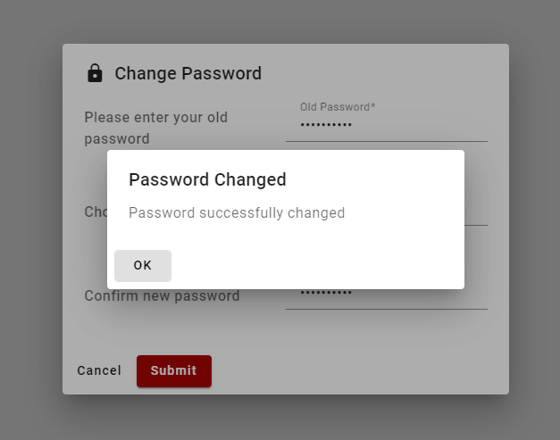
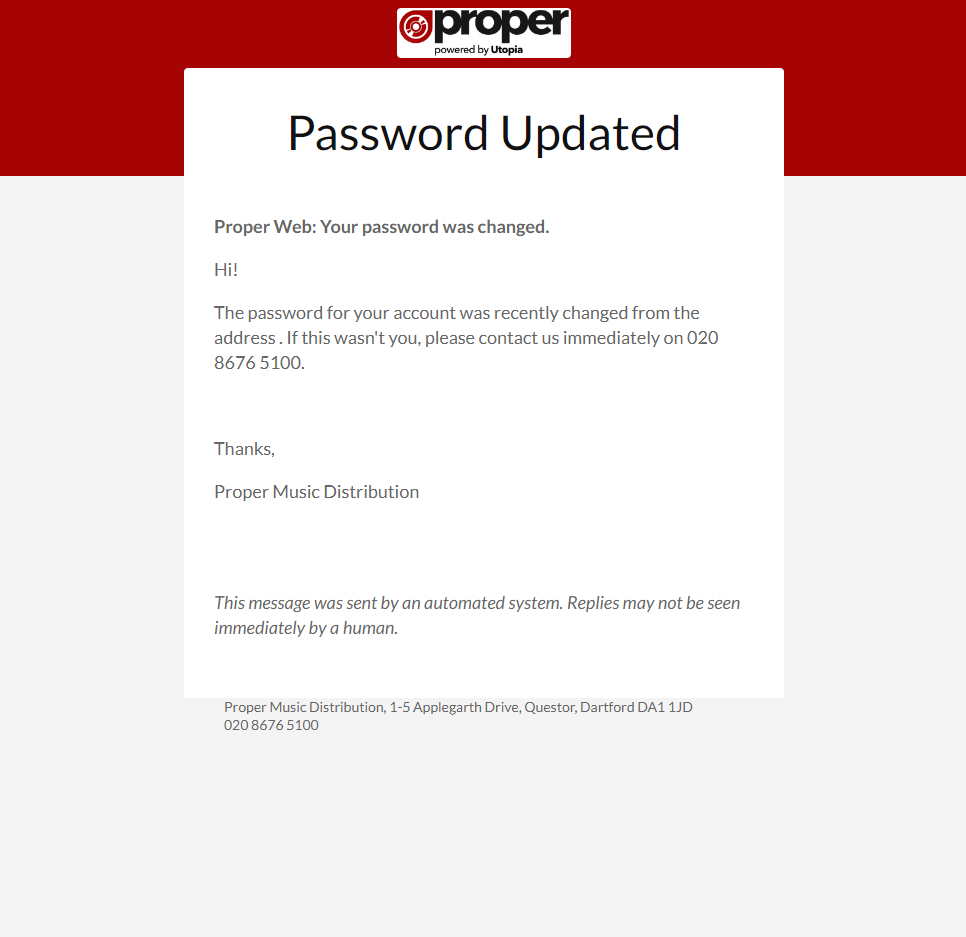

# Changing your Password
To change your password, click the "Change Password" button under user account settings.

Then on the popup, enter your old password, your new password, confirm your new password then click "Submit".

If your password change was successful then you will see the following popup:

And the following confirmation email:

