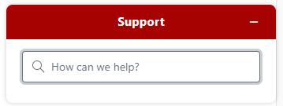
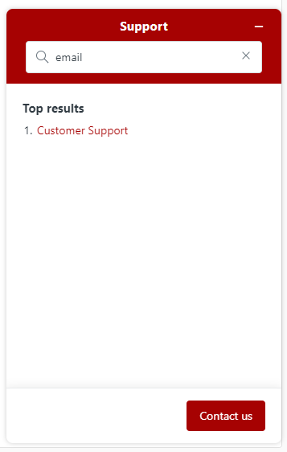
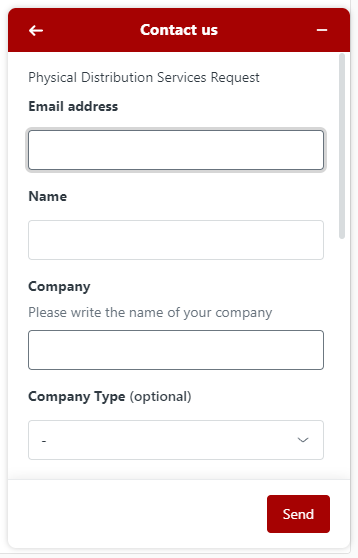
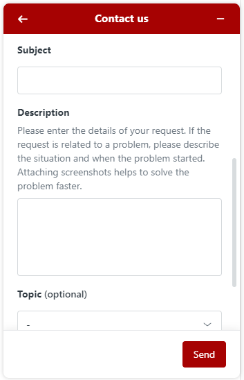
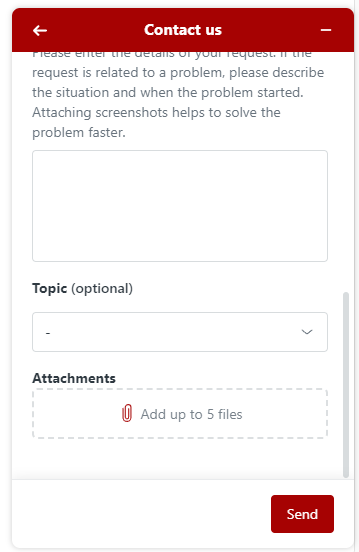

# Zendesk Integration

ProperWeb includes a Zendesk support desk integration which allows users to request help from the Proper Music Team.

## Support Button
To access Zendesk Support, there is a support button at the bottom right of every page. Clicking this button will open the Zendesk Support widget and allow the user to start the process of submitting support requests.

## Support Widget
The support widget is the main way to request support in ProperWeb. In this widget you can search for a help topic or use the "Contact Us" button to fill out a support request form which will be passed onto the Proper Music Team.

:::note

You need to search for a topic in order for the "Contact Us" button to appear.

:::

### Topic Search

In order to start using the support widget you need to first search for a support topic.

Once you have searched for a topic, relevant results will appear which you can click and view within the widget itself. If there are no results or you wish to submit a support request, the "Contact Us" button will be available at the bottom of the widget.

### Request Form

To submit a request, fill in the required fields and hit the "Send" button, you will then recieve a confirmation email that your request has been recieved by the support team.

#### Requried Fields
- Email address
- Name
- Company
- Subject - title of your issue
- Description

#### Optional Fields
- Company Type
- Topic
- Attachments (Max 5) 

#### Attachments
You can submit up to 5 attachments to help the support team with your request/issue.
